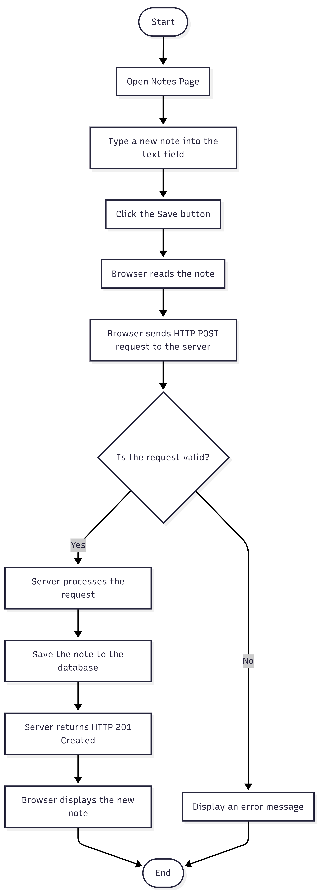
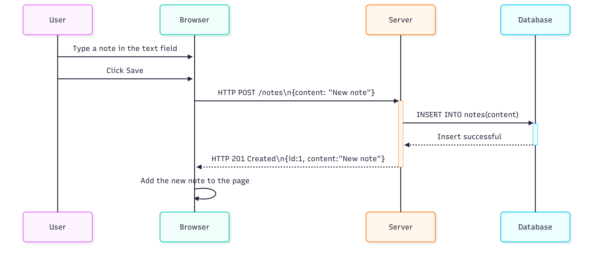

# Notes Application
## Description

This project is a simple web-based Notes Application developed using HTML, CSS, JavaScript, Node.js, and Express. The application allows users to create new notes by typing text into an input field and clicking the **Save** button.

The application demonstrates how a web browser communicates with a server using the HTTP protocol. When a user submits a new note, the browser sends an HTTP POST request to the server. The server processes the request and returns an appropriate response. If a database is connected, the note is stored permanently and can be retrieved whenever the page is reloaded.

## Features

- Create a new note.
- Send data to the server using HTTP POST.
- Display notes on the webpage.
- Demonstrates client-server communication.
- Can be extended with a MySQL database for permanent storage.

## Technologies Used

- HTML5
- CSS3
- JavaScript
- Node.js
- Express.js
- HTTP Protocol

## Project Structure

```text
project-folder/
│
├── public/
│   ├── style.css
│   └── script.js
│
├── views/
│   └── index.html
│
├── server.js
├── package.json
└── README.md
```

## Activity Diagram
The activity diagram illustrates the workflow followed when a user creates a new note by typing text into the input field and clicking the **Save** button.



---

## Sequence Diagram
The sequence diagram illustrates the interaction between the User, Browser, Server, and Database during the process of creating and saving a new note.

